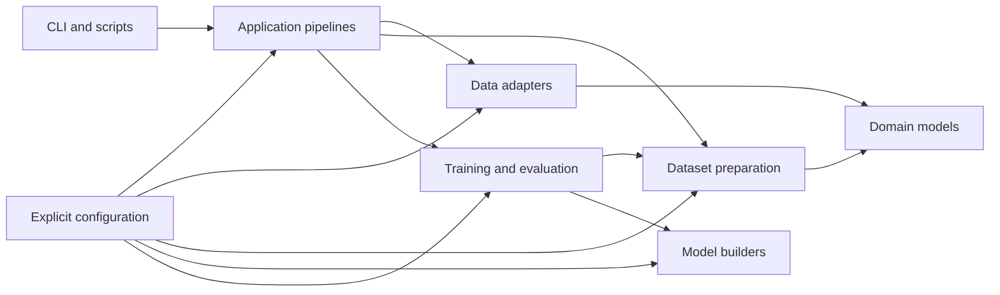

# Target Architecture

## Purpose

The target architecture separates data access, domain data, feature
engineering, model construction, training, evaluation, configuration,
and application orchestration.

The restructuring must preserve the currently tested behavior unless a
change is explicitly implemented and tested in a separate commit.

## Main dependency rule

High-level pipeline code may depend on lower-level domain and service
interfaces. Lower-level modules must not depend on scripts, CLI code, or
global runtime settings.

Runtime configuration must be passed explicitly instead of being read
from mutable module-level state.



## Target package responsibilities

The following layout is a target. Step 4 will reach it incrementally;
it is not a request to move all files in one commit.

```
src/football_outcomes/
    application/
        pipelines.py
        results.py

    config/
        models.py
        loading.py
        profiles.py
        constants.py

    domain/
        matches.py
        teams.py
        players.py
        bundles.py

    data/
        snapshots.py
        footystats.py
        sofifa.py

    matching/
        player_matching.py
        lineup_matching.py

    features/
        match_features.py
        team_strength.py
        positions.py

    datasets/
        arrays.py
        targets.py
        rounds.py
        mappings.py

    modeling/
        common.py
        v1.py
        v2.py
        strength_pretraining.py

    training/
        rolling.py
        optimization.py
        callbacks.py

    evaluation/
        metrics.py
        baselines.py
        predictions.py

    cli/
        main.py
```

## Responsibility boundaries

### Application

Application modules coordinate an entire use case, such as:

- loading an offline snapshot;
- preparing the selected matches;
- constructing arrays;
- building a model;
- running rolling evaluation;
- saving a result.

They should contain orchestration, not feature calculations or neural
network layer definitions.

### Configuration

Configuration modules define immutable runtime configuration objects,
load values from supported sources, validate combinations, and provide
explicit named profiles.

Static football constants may remain here, but runtime decisions must
not be hidden in module-level booleans.

### Domain

Domain modules define football-related objects and data bundles. They
must not perform network access, read environment variables, write
experiment files, or build TensorFlow models.

### Data adapters

Data adapters load and save snapshots or communicate with external data
sources. They translate external data into domain objects.

FootyStats retrieval and SoFIFA CSV loading are separate adapters.

### Matching and features

Matching resolves identities and lineups. Feature modules calculate
pre-match values from domain objects.

They do not choose training windows or construct TensorFlow models.

### Datasets

Dataset modules convert featured matches into deterministic model-ready
arrays, targets, category mappings, and rolling rounds.

### Modeling

Modeling modules construct and compile model architectures. v1, v2, and
strength-pretraining builders remain separate and share only genuinely
common helpers.

They do not load snapshots or choose matches.

### Training and evaluation

Training controls optimization and rolling windows. Evaluation calculates
metrics, stores out-of-sample predictions, and implements classical
baselines.

## Intended application interfaces

The exact types may evolve during Step 4, but the pipeline should
converge on interfaces resembling:

```python
bundle = load_bundle(config.data)

matches = select_matches(
    bundle,
    config.selection,
)

dataset = build_dataset(
    matches,
    config.features,
    config.target,
)

model = build_model(
    dataset.input_spec,
    config.model,
)

result = run_rolling_evaluation(
    dataset,
    model,
    config.training,
    config.output,
)
```

Each function receives the information it needs explicitly.

## Legacy compatibility rule

During Step 4, existing public functions may remain as compatibility
wrappers. A wrapper may translate legacy arguments into the new
interfaces, but new implementation modules must not import the legacy
main script.

## Legacy-code transition

The repository currently contains older API-Football and Flashscore
implementations alongside the active FootyStats implementation.

During Step 4:

- new implementation modules will be added alongside legacy modules;
- legacy modules will not be renamed merely to free a preferred name;
- compatibility imports will remain until all active callers have moved;
- new packages will use unambiguous names such as `application`,
  `datasets`, `domain`, and `modeling`.

Before Step 5, references to every legacy module will be inventoried.

During Step 5:

- unused source modules will normally be deleted;
- historically useful standalone scripts may be moved under
  `scripts/deprecated`;
- submission-specific entry points and global switches will be removed;
- temporary `fs_` prefixes may then be reconsidered once conventional
  names are available.

Git history and milestone tags are the permanent archive for deleted
source files.

## Step 4 extraction order

Refactoring will proceed in this order:

1. Introduce configuration dataclasses and a legacy-settings adapter.
2. Separate dataset construction from the current training utility file.
3. Separate v1, v2, and pretraining model builders.
4. Extract rolling-window orchestration and learning-rate logic.
5. Extract evaluation metrics, baselines, and result persistence.
6. Introduce an application-level offline training pipeline.
7. Reduce the legacy script to a compatibility entry point.
8. Switch the CLI to the application pipeline.

Each extraction must preserve the regression tests and runtime smoke
tests before the next extraction begins.

## Non-goals for Steps 3 and 4

The following are deliberately postponed:

- downloading new FootyStats data;
- replacing the historical SoFIFA snapshots;
- implementing SoFIFA imputation;
- changing v1 or v2 architecture;
- running new hyperparameter experiments;
- changing target definitions;
- removing legacy compatibility code prematurely;
- deleting or renaming legacy API-Football and Flashscore modules before
  their callers have been inventoried.
