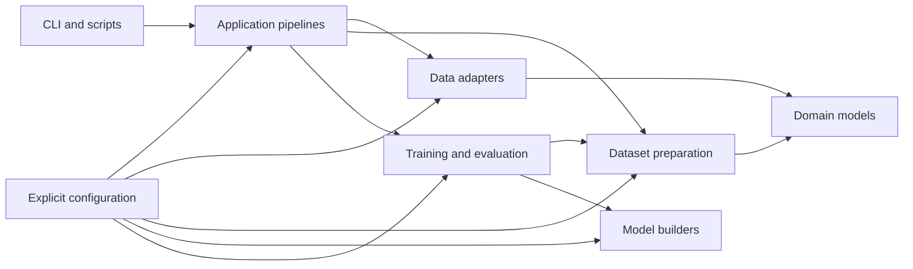

# Target Architecture

## Purpose

The target architecture separates data access, domain data, feature
engineering, model construction, training, evaluation, configuration,
and application orchestration.

The restructuring must preserve the currently tested behavior unless a
change is explicitly implemented and tested in a separate commit.

## Main dependency rule

High-level pipeline code may depend on lower-level domain and service
interfaces. Lower-level modules must not depend on scripts, CLI code, or
global runtime settings.

Runtime configuration must be passed explicitly instead of being read
from mutable module-level state.

## Responsibility boundaries

#### Application

Application modules coordinate an entire use case, such as:

loading an offline snapshot;
preparing the selected matches;
constructing arrays;
building a model;
running rolling evaluation;
saving a result.

They should contain orchestration, not feature calculations or neural
network layer definitions.

#### Configuration

Configuration modules define immutable runtime configuration objects,
load values from supported sources, validate combinations, and provide
explicit named profiles.

Static football constants may remain here, but runtime decisions must
not be hidden in module-level booleans.

#### Domain

Domain modules define football-related objects and data bundles. They
must not perform network access, read environment variables, write
experiment files, or build TensorFlow models.

#### Data adapters

Data adapters load and save snapshots or communicate with external data
sources. They translate external data into domain objects.

FootyStats retrieval and SoFIFA CSV loading are separate adapters.

#### Matching and features

Matching resolves identities and lineups. Feature modules calculate
pre-match values from domain objects.

They do not choose training windows or construct TensorFlow models.

#### Datasets

Dataset modules convert featured matches into deterministic model-ready
arrays, targets, category mappings, and rolling rounds.

#### Modeling

Modeling modules construct and compile model architectures. v1, v2, and
strength-pretraining builders remain separate and share only genuinely
common helpers.

They do not load snapshots or choose matches.

#### Training and evaluation

Training controls optimization and rolling windows. Evaluation calculates
metrics, stores out-of-sample predictions, and implements classical
baselines.
